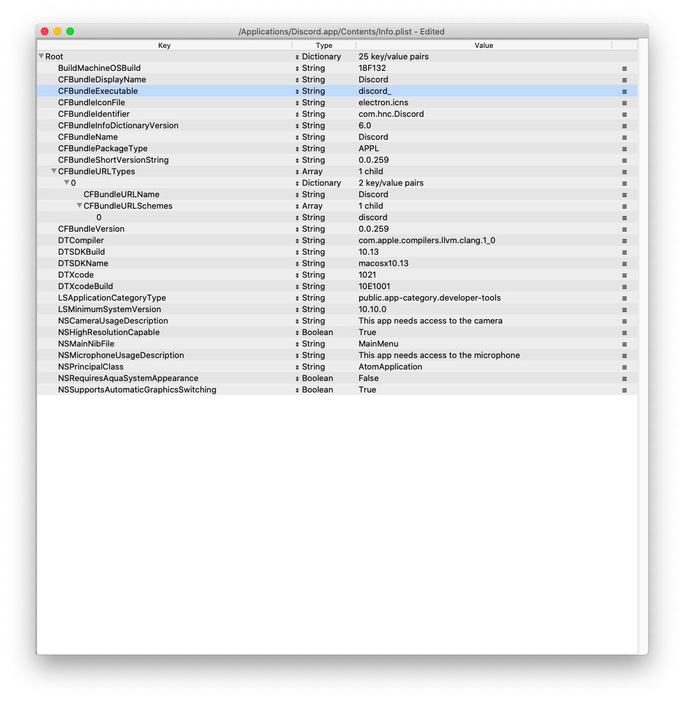

## Descrizione

Discord su “Ryzentosh” é una delle app che presentano problemi e crash.
Il motivo dietro ai crash di Discord é l’utilizzo di una libreria dei processori Intel ovviamente non presente su Ryzen, chiamata MKL (Math Kernel Library).

## Come risolvere?

Una modo sarebbe quello di disattivare l’attivazione vocale, andando ad utilizzare il Push-to-Talk. Ovviamente questo renderebbe l’app molto piú scomoda nel suo utilizzo quotidiano.
Tuttavia, in un post su Reddit, l’utente neoney_ ha trovato una soluzione molto piú comoda, di seguito riportata e tradotta.
Procedura

> N.B.: la seguente procedura DEVE essere ripetuta dopo OGNI aggiornamento di Discord.

Apriamo un Terminale e scriviamo

```cd /Applications/Discord.app/Contents/MacOS```

poi

```echo "MKL_DEBUG_CPU_TYPE=5 ./Discord" > discord_```

A questo punto chiudiamo il Terminale ed apriamo il `Finder`. Andiamo in `Applicazioni` e facciamo click destro su `Discord.app` > `Mostra contenuto pacchetto`. Muoviamoci in `Contents` ed apriamo con un programma apposito (consiglio **ProperTree** di Corpnewt) il file `Info.plist`. Adesso modifichiamo la proprietá `CFBundleExecutable`, cambiando il suo valore in `discord_` come nello screenshot di seguito:



Salviamo il file modificato ed avviamo normalmente Discord.